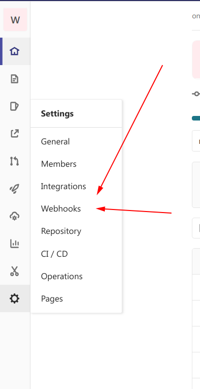

# gitlab-code-review-telegram-bot

## Как использовать

- Зайти в личку к своему телеграм-боту и написать ему `/iam gitlabname`, где gitlabname - имя в вашем инстансе гитлаба
- При создании МР, если вы хотите чтобы кто-то его проревьюил, укажите в описании МР через запятую ревьюеров `reviewers: @gitlablogo, @gitlablogo2`
- Если вы ревьюер и хотите апрувнуть МР, оставьте комментарий на верхнем уровне `approve`
- Если вы ревьюер и хотите сообщить о том, что закончили смотреть МР и есть замечания, оставьте комментарий на верхнем уровне `watched`
- Если вы автор МР и поправили замечания ревьюера, оставьте комментари `fixed` в ответ на `watched`

## Как подключить готового бота в своей репозиторий

- Зайти в настройка проекта гитлаб
- Перейти в настройку вебхуков

- Создай новый вебхук со следующими полями
    - url: url до вебхука бота
    - разрешения
        - Comments
        - Merge request events
    - Enable SSL verification
- Используй!

## Как создать свой инстанс бота

Бот завернут в докер-образ, поэтому чтобы запустить свой инстанс, достаточно запустить докер-образ со следующими env переменными:
- `GITLAB_TOKEN` - апи токен для вашего инстанса гитлаба с разрешениями `api, read_api`
- `TG_TOKEN` - токен вашего телеграм бота
- `FILE_PATH` - путь до файла с настройками юзеров (матчинг TG чата и gitlab username). Чтобы база юзеров жила между перезапусками контейнера - создай volume и прокидывай `FILE_PATH` до `/mountedVolumeDir/users.json`

## Как разрабатывать

- Пиши тесты
- Пиши функционал
- Используй npm version для публикации новых версий. В npm пока ничего не публикуется, но github-actions настроены на сборку нового образа по git-tag